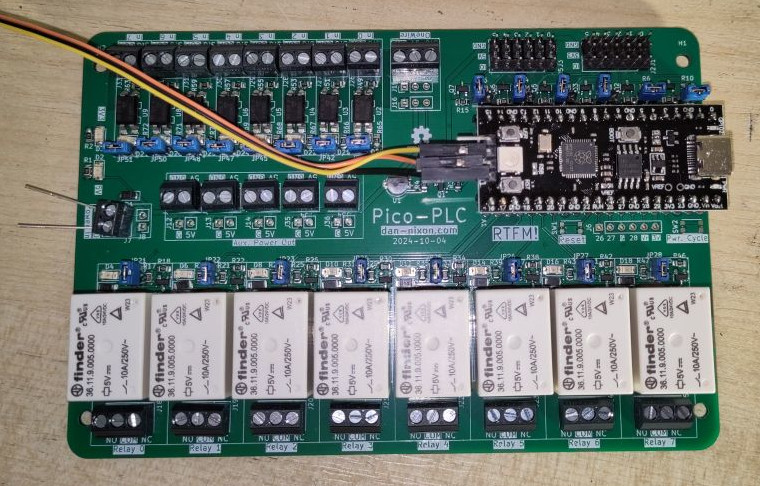

# Pico-PLC

A [Raspberry Pi Pico](https://www.raspberrypi.com/products/raspberry-pi-pico/) powered PLC like general purpose control board.

## Pins

|Device     |Pin   |
|-----------|------|
|OneWire Bus|PIN_22|
|IO 0       |PIN_0 |
|IO 1       |PIN_1 |
|IO 2       |PIN_2 |
|IO 3       |PIN_3 |
|IO 4       |PIN_4 |
|IO 5       |PIN_5 |
|Relay 0    |PIN_7 |
|Relay 1    |PIN_6 |
|Relay 2    |PIN_16|
|Relay 3    |PIN_17|
|Relay 4    |PIN_18|
|Relay 5    |PIN_19|
|Relay 6    |PIN_20|
|Relay 7    |PIN_21|
|Input 0    |PIN_15|
|Input 1    |PIN_14|
|Input 2    |PIN_13|
|Input 3    |PIN_12|
|Input 4    |PIN_11|
|Input 5    |PIN_10|
|Input 6    |PIN_9 |
|Input 7    |PIN_8 |
